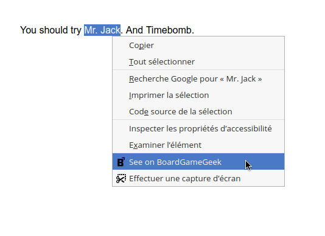

# SOBGG: See On BoardGameGeek

A tiny web extension (working on Chrome, Firefox, an certainly more) that adds a context menu entry to search the selected text on https://boardgamegeek.com. If a direct match is found, the extension opens the BGG game page in a new tab. If not, it opens a BGG search page with the selected text.

    
Gif example

